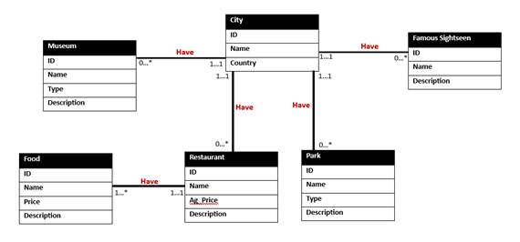

# Navigate City

NavigateCity.com is a web-based application designed to help people navigate through cities by providing them with information related to the places they want to visit. The application has a database that includes museums, restaurants, parks, and famous sights of different cities around the world. Users can search for a specific city and get information about that city. NavigateCity.com is a convenient and user-friendly tool that makes it easy for people to explore new cities and find the best places to visit.

## How to Access

Our plan for the future is to have the website hosted on the internet, making it necessary only to have an internet connection and a web browser to access it. As of now, the user needs a few things to be able to plan their next trip.

To access the website, you need the following:

1. MySQL server running either locally (localhost) or hosted by a hosting provider.
2. Python 3 installed on your machine.
3. An IDE such as VScode.
4. An OpenAI API key (if you want to use the AI feature).

Once you have these prerequisites installed, follow these steps:

1. Open the project folder in the IDE and access the file `secrets.json` in the data folder.
2. Add the necessary information regarding your database and API key.
3. Open the terminal and run the following commands:
   - `pip install flask`
   - `pip install pymysql`
   - `pip install openai`
   - `python ./createdatabase/create.py` (to set up the database)
   - `python ./app.py` (to start the server on localhost)

After completing these steps, the website should be up and running on localhost. To access the website, open the file `Landing.html`.

The website consists of two pages:

1. Explore page: Allows the user to navigate through the available queries.
2. AI page: Available in the right-hand corner of the website, where the user can write requests in plain English, and an AI will generate queries for the program to execute.

## Database Diagram

## License and Credits

- 2023 © Matheus Silva
- 2023 © Bereket Lemma

Project assisted by Pete Tucker, Professor of Computer Science, Whitworth University.